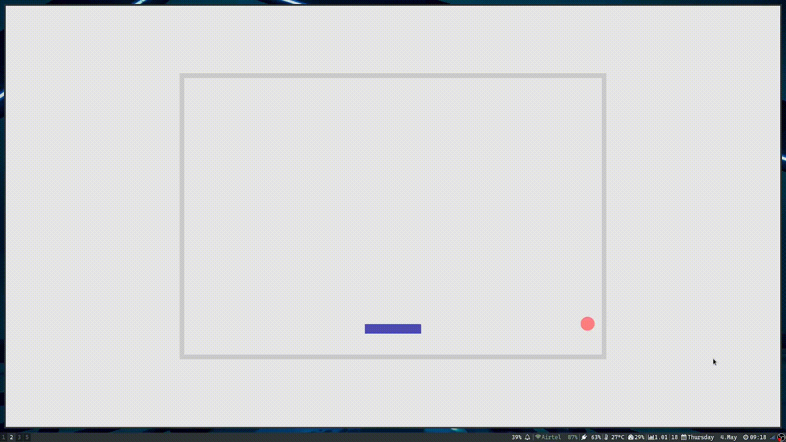

# Ing-Ong
Simple ping pong game in rust

## Demo



## Prerequisites

### Clone the source code

First clone the source code:

```sh
git clone https://github.com/prajnastra/ing-ong.git
cd ing-ong
```

### Install the Rust compiler with `rustup`

1. Install [`rustup.rs`](https://rustup.rs/).

3. To make sure you have the right Rust compiler installed, run

   ```sh
   rustup override set stable
   rustup update stable
   ```

## Building

### Linux 

```sh
cargo build --release
```

### Install
```sh
mkdir -p ~/.local/bin
cp target/release/ing-ong ~/.local/bin/
```

## Usage
```bash
ing-ong
```
